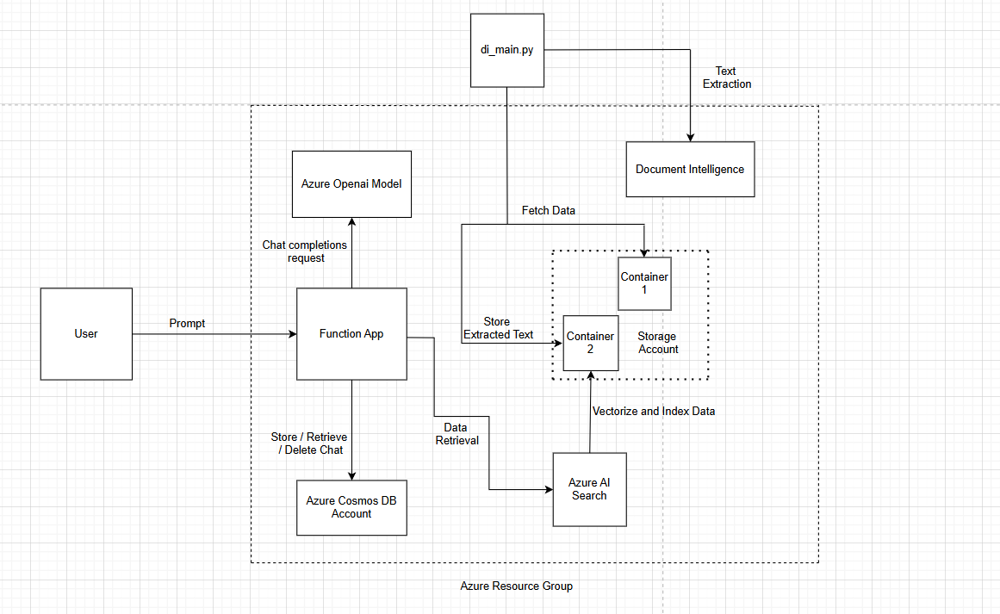

# Architecture 

This document outlines the architecture and data flow for the deployed Azure-based RAG chatbot solution.

## Azure Resources
- **Resource Group:** `<your-resource-group>`
- **Function App:** `<your-function-app>` (Python, HTTP trigger; Flex Consumption)
- **Storage Account:** `<your-storage>` (required by Functions; holds raw + processed content)
- **Azure OpenAI:** `<your-openai-resource>` (region `<region>`, deployments: Chat + Embeddings)
- **Azure AI Search:** `<your-search-service>`
  - **Indexing & vectorization are done in the Azure AI Search portal** via *Import and vectorize data* (indexer points to the processed Blob container)
  - Optional **Semantic configuration**
- **Azure Cosmos DB:** `<your-cosmos-account>` — DB: `<db>` / Container: `<container>`
- **Cognitive Services — Document Intelligence (Form Recognizer):**
  - Used **by our own script** (`document_intelligence/di_main.py`) to extract text/layout from PDFs/images
  - Extracted/normalized output is stored to Blob (processed container) for the portal indexer

## Components
- **HTTP Function (`function_app/chatbot_function/`)**
  - Endpoint: `POST /api/chatbot_function`
  - Body: `{"message": "...", "session_id": "...", "role": "..."}`  
  - Returns: `{"reply": "...", "session_id": "..."}`  
  - Special commands: `"history"`, `"clear"`, `"restart"`
- **Chat Core / Utilities**
  - `openai_client.py` — Azure OpenAI client
  - `cosmos_session_manager.py` — session load/save/clear (Cosmos)
  - `utils.py` — summarization & token trimming
  - `utils_rewrite.py` — **conversation-aware** rewrite to a standalone query
- **RAG Layer**
  - `search_client.py` — `SearchClient` (API key or RBAC)
  - `retrieval.py` — **hybrid search** (BM25 + vector over `text_vector`); optional Semantic; formats sources
  - `prompts.py` — relaxed grounded prompt (allows analysis/discussion tied to retrieved passages)
- **Document Intelligence Pipeline**
  - `document_intelligence/di_main.py`, `di_utils.py`
  - Runs the **DocumentAnalysisClient** to OCR/layout raw files, normalize text (and split by page/sections), then **writes processed text/JSON** to a Blob **processed** container used by the portal indexer
- **Frontend (Vite + React)**
  - Calls Function over HTTP; `.env` holds `VITE_FUNCTION_URL`
  - Session controls: **copy**, **load**, **history**, **clear**, **new session** (Cosmos-backed)

## Knowledge Base Build
- **Source**: Raw docs (TXT/PDF/images) in Blob → processed through **`di_main.py`** using Document Intelligence
- **Output**: Cleaned/normalized text (optionally paginated/chunked) written to a **processed Blob container**
- **Indexing & Vectorization**: In **Azure AI Search portal**  
  - Use *Import and vectorize data* with **Blob (processed)** as the data source  
  - Configure fields (e.g., `id`, `title`, `chunk`, `parent_id`, `chunk_id`, `language`, `url`, `text_vector`) and vector profile (HNSW)  
  - Document embeddings are created by the portal; **no custom embedding script** is used for documents

## Runtime Data Flow
1. **UI → Function** (`message`, `session_id`)
2. **Session load** from Cosmos (prior turns)
3. **Query rewriting** makes the latest input self-contained (resolves pronouns/references)
4. **RAG retrieval** against Azure AI Search (**hybrid**: BM25 + vector; optional Semantic)
5. **Prompt assembly** (original user query + retrieved passages; relaxed grounded rules)
6. **Azure OpenAI** chat completion
7. **Persist** conversation (Cosmos)
8. **Response**: `{ reply, session_id }` (sources can be added to the payload/UI)

## Endpoint
`POST https://<app>.azurewebsites.net/api/chatbot_function`  
Headers: `Content-Type: application/json`

## Configuration (App Settings)
- **Azure OpenAI:**  
  `AZURE_OPENAI_ENDPOINT`, `AZURE_OPENAI_API_VERSION`, `AZURE_OPENAI_DEPLOYMENT_NAME`,  
  `AZURE_OPENAI_EMBEDDING_DEPLOYMENT`, `AZURE_OPENAI_KEY`
- **Azure AI Search (KB):**  
  `AZURE_SEARCH_ENDPOINT`, `AZURE_SEARCH_INDEX`, `AZURE_SEARCH_API_KEY` **or** RBAC,  
  `AZURE_SEARCH_SEMANTIC_CONFIG` (optional)
- **Cosmos DB (sessions):**  
  `COSMOS_URI`, `COSMOS_KEY`, `COSMOS_DB`, `COSMOS_CONTAINER`
- **Document Intelligence (used by `di_main.py` when you run ingestion):**  
  `FORMREC_ENDPOINT`, `FORMREC_KEY`, Blob connection/settings for input and processed containers

## Design Decisions
- **Document Intelligence via our code** (`di_main.py`) ensures consistent OCR/layout and normalization; outputs to Blob (processed)
- **Portal-managed indexing & document vectorization** simplifies maintenance and keeps embeddings consistent
- **Hybrid retrieval** improves recall; Semantic Ranker optional
- **Conversation-aware query rewriting** boosts follow-up accuracy
- **Relaxed grounded prompt** enables on-topic discussion/analysis of stories (no unnecessary refusals)
- **Session persistence** in Cosmos DB with full UI controls
- **Security**: keys in Function App Configuration; prefer RBAC where possible
